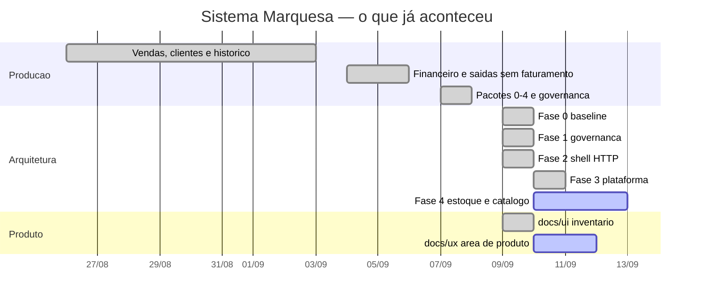
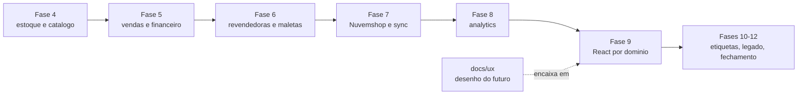

# Mapa mestre vivo — Sistema Marquesa

Fonte visual de acompanhamento. Reconstruído do repositório: histórico Git,
Master Plan, baselines, documentação de domínio, migrations, `docs/ui/`,
`docs/ux/` e código atual.

**Snapshot:** 2026-09-10 · **Autoridade de fases:**
[architecture/MASTER-PLAN-SISTEMA-MARQUESA-2026-09.md](architecture/MASTER-PLAN-SISTEMA-MARQUESA-2026-09.md)
· **Autoridade de negócio:** [../api/REGRAS.md](../api/REGRAS.md)

Legenda: ✅ concluído · 🟡 em andamento · ⏳ futuro · 🔴 bloqueado · ⚠️ atenção · — não se aplica

> Onde uma data não pôde ser provada por commit ou documento versionado, o
> campo diz **data não confirmada**. Nada aqui foi inferido por semelhança.

---

## Agora

**Ontem — 2026-09-09**
- Master Plan de arquitetura registrado como direção (`04edb02`) e Fase 0 congelada (`b08734f`).
- Auditoria das saídas que entraram como venda integrada; categoria `sorteio` no domínio (`8055732`, `ae81c5b`).
- Fase 1 (documentação/governança) e a maior parte da Fase 2 (shell HTTP) executadas na branch de refatoração, 21:10–23:33.
- Codex preparou `docs/ui/` sobre o baseline `ae81c5b`.

**Hoje — 2026-09-10**
- Fase 2 fechada: 142/142 contratos na tabela de rotas (`409ef78`).
- Fase 3 concluída: erros/log, config tipada, helpers D1, adapters, correlação (`28cd460`…`26277f3`).
- Fase 4.1 (razão e saldo) e 4.2 (variações e SKU) concluídas.
- Fase 4.3 — Monte Seu Colar: modelo reaberto, decidido com a Sthefany e implementado (`2490502`…`d9e5196`), com `PERSONALIZACAO_ATIVA` ainda `false`.
- Decisão registrada: histórico incompleto não se reconstrói por adivinhação (`b195a32`) — abre o item 4.4.
- Área permanente de produto/UX criada (`1d86337`); material de Vendas, Etiquetas e Personalização ainda **não commitado**.

**Próximo**
- Reconciliar e publicar a trilha de refatoração (hoje só existe local).
- Fase 4.4 — Inventário.
- Cadastro dos SKUs e configurações do Monte Seu Colar (dado, não código).

**Bloqueios**
- 🔴 `claude/refactor-sistema-marquesa` (`496cc0e`) tem **55 commits à frente do `main` e nenhum remoto**. `origin/main` (`69ac8ac`) está 4 commits atrás do `main` local (`ae81c5b`).
- 🔴 Monte Seu Colar desligado em produção: 4 componentes físicos sem cadastro, 3 configurações ausentes.
- ⚠️ Maleta 12 aberta com o código `326660` em campo — trava o ajuste do saldo legado.
- ⚠️ P1 cron de sync, P2 giro/comissão, P11 migration do sorteio (ver *Decisões*).

---

## Estado das quatro trilhas

| Trilha | Quem | Onde vive | Estado |
|---|---|---|---|
| Engenharia / refatoração | Claude | worktree `../Marquesa-Claude-Refactor`, branch `claude/refactor-sistema-marquesa` (`496cc0e`) | 🟡 Fase 4 em curso · 🔴 não publicada |
| Produto / UX | Gustavo + Codex | `docs/ux/` (futuro) e `docs/ui/` (existente), branch `codex/ui-system-marquesa` (`1d86337`) | 🟡 material chegando; nenhuma tela aprovada |
| Integração | — | ainda não começou | ⏳ depende da Fase 9 |
| Produção | operação real | `main` → Worker + D1 + Pages | ✅ estável no release `3176a9f` |

**Regra das trilhas:** desenho depositado em `docs/ux/` não avança nenhuma
linha da matriz. Uma linha avança quando há código escrito na fase certa **e
prova executada**.

---

## Matriz principal

Colunas: *Entendido* (regra escrita e auditada) · *Arquitetado* (extraído e
provado na refatoração) · *Desenhado* (material de UX) · *Integrado* (React
consumindo API real) · *Produção* (funcionando para a Sthefany hoje).

| Área | Entendido | Arquitetado | Desenhado | Integrado | Produção | Próximo passo |
|---|:--:|:--:|:--:|:--:|:--:|---|
| Fundação / Baseline | ✅ | ✅ | — | — | — | manter `npm test` como gate |
| Governança | ✅ | ✅ | — | — | ✅ | nada aberto |
| HTTP / Router | ✅ | ✅ | — | — | ⏳ | publicar a refatoração |
| Plataforma (config, erros, D1, adapters) | ✅ | ✅ | — | — | ⏳ | idem |
| Razão e saldo | ✅ | ✅ | — | — | ✅ | — |
| SKU e variações | ✅ | ✅ | — | — | ✅ | — |
| Monte Seu Colar | ✅ | ✅ | 🟡 | ⏳ | 🔴 | cadastrar 4 SKUs + 5 configurações |
| Inventário | ✅ | ⏳ | ⏳ | ⏳ | ⏳ | **item 4.4 — próximo da fila** |
| Catálogo | ✅ | ⏳ | ⏳ | ⏳ | ✅ | item 4.5 |
| Fotos | ✅ | ⏳ | ⏳ | ⏳ | ✅ | item 4.5 · P9 aberta |
| Publicação interna | ✅ | ⏳ | ⏳ | ⏳ | ✅ | item 4.5 |
| Importações | ✅ | ⏳ | ⏳ | ⏳ | ✅ | item 4.6 |
| Vendas | ✅ | ⏳ | 🟡 | ⏳ | ✅ | Fase 5 |
| Pagamentos / Financeiro | ✅ | ⏳ | ⏳ | ⏳ | ✅ | Fase 5 · P3 e P12 abertas |
| Clientes | ✅ | 🟡 | ⏳ | ⏳ | ✅ | Fase 5 |
| Garantias | ✅ | 🟡 | ⏳ | ⏳ | ✅ | Fase 5 |
| Reparos (tela) | ⏳ | ⏳ | ⏳ | ⏳ | — | domínio novo, não existe |
| Saída sem faturamento | ✅ | ✅ | 🟡 | ⏳ | ⚠️ | P11: migration do `sorteio` não aplicada |
| Revendedoras | ✅ | ⏳ | ⏳ | ⏳ | ✅ | Fase 6 |
| Maletas | ✅ | ⏳ | ⏳ | ⏳ | ⚠️ | Fase 6 · maleta 12 aberta |
| Comissões | 🟡 | ⏳ | ⏳ | ⏳ | ✅ | 🔴 P2 giro/comissão |
| Nuvemshop | ✅ | 🟡 | — | — | ✅ | Fase 7 |
| Sync | ✅ | 🟡 | — | — | ⚠️ | 🔴 P1 cron implantado desconhecido |
| Reconciliação | ✅ | ⏳ | ⏳ | ⏳ | ⚠️ | backend existe, tela não; migrations não aplicadas |
| Analytics | ✅ | ⏳ | ⏳ | ⏳ | ✅ | Fase 8 |
| Dashboard legado | ✅ | — | 🟡 | — | ✅ | Fase 10, depois Fase 11 |
| Frontend React | ✅ | ⏳ | 🟡 | ⏳ | 🟡 | Fase 9 · 5 superfícies de 15 famílias |
| Etiquetas | ✅ | ⏳ | 🟡 | ⏳ | ✅ | Fase 10 |

O estado de "Integrado" por tela vem de
[ux/07-mapping/integration-status.md](ux/07-mapping/integration-status.md);
hoje **nenhuma** tela tem verificação executada.

---

## Master Plan

Fases do plano de arquitetura de 2026-09-09. Commits da Fase 1 em diante vivem
em `claude/refactor-sistema-marquesa` e **não estão em `main`**.

| Fase | Estado | Início | Conclusão | Commits | Prova / gate |
|---|:--:|---|---|---|---|
| 0 — congelar e provar o baseline | ✅ | 2026-09-09 | 2026-09-09 | `04edb02`, `b08734f` | inventário de rotas, manifesto de 27 migrations, baseline de regressão |
| 1 — documentação e governança | ✅ | 2026-09-09 | 2026-09-09 | `6d6c58b`…`aa419d6`, `130d421` | links validados, 27 checks + 23 hard-denies |
| 2 — extrair o shell HTTP | ✅ | 2026-09-09 | 2026-09-10 | `3204210`, `5b4c2ae`…`780d514`, **`409ef78`** | 142 contratos congelados; `index.js` de 2.427 para 83 linhas |
| 3 — plataforma e adapters | ✅ | 2026-09-10 | 2026-09-10 | `28cd460`, `e94a5e0`, `d263f99`, `1086e10`, `91aa4ab`, `26277f3` | config fail-closed, erros, helpers D1, correlação |
| **4 — estoque e catálogo** | **🟡** | 2026-09-10 | — | ver abaixo | por item |
| 5 — vendas, clientes, financeiro, garantias | ⏳ | — | — | — | P3 e P12 antes |
| 6 — revendedoras, maletas, comissão | ⏳ | — | — | — | 🔴 P2 antes |
| 7 — Nuvemshop, sync, reconciliação | ⏳ | — | — | — | 🔴 P1 antes |
| 8 — analytics e projeções | ⏳ | — | — | — | números idênticos nos datasets |
| 9 — alinhar o React aos domínios | ⏳ | — | — | — | paridade por fluxo |
| 10 — isolar etiquetas e build legado | ⏳ | — | — | — | mesmos entrypoints |
| 11 — aposentadoria do legado | ⏳ | — | — | — | 🔴 P5 e aprovação humana |
| 12 — fechamento arquitetural | ⏳ | — | — | — | DoD completo |

### Fase 4 — Estoque e Catálogo (em curso)

```text
4.1 Razão e saldo                       ✅  2026-09-10  c643555
4.2 Variações e SKU                     ✅  2026-09-10  cbfa504 · 706bc0c · fadd06a · 843fd78
4.3 Kits / Monte Seu Colar              ✅ backend  2490502…d9e5196
                                        🟡 UX  ·  🔴 produção (feature desligada)
4.4 Inventário                          ▶  próximo   (só a decisão registrada: b195a32)
4.5 Categorias, fotos, personalização,
    publicação interna                  ⏳
4.6 Importações relacionadas            ⏳
```

- **4.1** — a invariante `produtos.qtd == SUM(movimentos.qtd)` virou gate executável.
- **4.2** — oito normalizações de SKU inventariadas e reduzidas a uma (`fadd06a`); espaço interno não diferencia SKU.
- **4.3** — 16 proteções provadas: dupla contagem, saldo próprio, slots, estorno, idempotência, concorrência, razão fechando. Falta **dado**, não código.
- **4.4** — regra fechada: movimento sem identidade permanece historicamente incompleto; a verdade volta por contagem física, virando movimento de ajuste pela razão.

---

## Timeline

| Data | Frente | Evento | Commit | Resultado |
|---|---|---|---|---|
| 2026-08-16 | Produção | checkpoint pré-bootstrap | `f3f08cb` | ponto de retorno |
| 2026-08-26–28 | Engenharia | Vendas vira painel comercial; Clientes nasce; revendedora deixa de ser cliente; planilha vira 695 vendas | `465e395`, `95a1e66`, `12ed28f`, `a1271e6` | histórico entra sem mover estoque |
| 2026-08-31 | Engenharia | desconto por peça e cancelamento com data | `59cbc44`, `ae9faa5` | preço da planilha existe no sistema |
| 2026-09-01 | Produção | `UPPER()` no JOIN lia 1 milhão de linhas por clique | `91dad84` | cota do D1 protegida |
| 2026-09-03 | Engenharia | reconciliação vendas × estoque × revendedoras | `cc513bd` | motor disponível |
| 2026-09-04–05 | Produção | saídas sem faturamento; PIX pendente não é receita; homônimas; `payment_status` | `c2ff478`, `68b014e`, `c5751f0`, `7ceadab` | financeiro deixa de mentir |
| 2026-09-06 | Engenharia | rodada de correções: consulta de 298 mil linhas, garantias, gráfico, variações, Top Revendedoras | `a16d004`…`7c5f8d0` | autorização de produção passa a ser por release (`ef0dcc3`) |
| 2026-09-07–08 | Produção | Pacotes 0–4 concluídos, gate estabilizado, governança production-first | `6715492`, `3176a9f`, `053e4f0`, `69ac8ac` | 790 produtos · 1.428 movimentos · 19 vendas · 0 divergências |
| 2026-09-09 | Arquitetura | Master Plan e Fase 0; auditoria não-receita integrada; `sorteio` no domínio | `04edb02`, `b08734f`, `8055732`, `ae81c5b` | baseline mensurável |
| 2026-09-09 | Produto/UX | Codex prepara `docs/ui/` sobre `ae81c5b` | não commitado | 15 famílias de tela mapeadas |
| 2026-09-09 21:10 | Engenharia | Fase 1 e os 142 contratos congelados | `6d6c58b`…`3204210` | fonte de verdade navegável |
| 2026-09-09 21:25–23:33 | Engenharia | Fase 2: leituras, depois escritas, saem do dispatcher | `5b4c2ae`…`9edc116` | dispatcher encolhendo |
| 2026-09-10 (manhã) | Engenharia | Fase 2 fechada e Fase 3 inteira | `409ef78`, `28cd460`…`26277f3` | `index.js` com 83 linhas |
| 2026-09-10 | Engenharia | Fase 4.1, 4.2 e 4.3; decisão do inventário | `c643555`…`496cc0e` | Monte Seu Colar existe, desligado |
| 2026-09-10 | Produto/UX | área permanente `docs/ux/` criada | `1d86337` | Vendas e Etiquetas descritas |
| próximo | Engenharia | publicar a refatoração; Fase 4.4 Inventário | — | — |

---

## Evolução





---

## Commits que fecharam algo

**Produção / go-live**
- `f3f08cb` — checkpoint pré-bootstrap (2026-08-16)
- `a1271e6` — a planilha vira 695 vendas; ticket médio deixa de ser "indisponível"
- `c2ff478` — peça que sai do estoque nem sempre é venda
- `6715492` — pacotes 0–4 do painel concluídos
- `3176a9f` — gate final estabilizado (release funcional)
- `053e4f0` — governança production-first consolidada
- `69ac8ac` — checkpoint final de `main` publicado em `origin`

**Fase 0 — baseline**
- `04edb02` — Master Plan de arquitetura 2026-09
- `b08734f` — baseline da Fase 0: rotas, migrations, regressão, Graphify

**Fase 1 — governança**
- `773e225` — taxonomia `architecture / domains / testing`
- `af98896` — decisões humanas pendentes registradas
- `3204210` — os 142 contratos HTTP viram inventário executável

**Fase 2 — shell HTTP**
- `5b4c2ae` — router extraído, primeiras rotas de leitura
- `9a19282` — primeiras escritas fora do dispatcher
- **`409ef78`** — shell HTTP terminado: 142 contratos na tabela de rotas

**Fase 3 — plataforma**
- `28cd460` — política de erro e log fora do entrypoint
- `e94a5e0` — configuração tipada, fail-closed, num lugar só
- `26277f3` — camada de plataforma registrada

**Fase 4 — estoque e catálogo**
- `c643555` — a invariante da razão vira gate executável (4.1)
- `fadd06a` — uma normalização de SKU para todo o backend (4.2)
- `2490502` — a composição de uma configuração vira dado (4.3)
- `d9e5196` — cenário N/O segue a configuração, não a contagem de slots (4.3)
- `496cc0e` — documento de desenho registra o que foi construído
- `b195a32` — o passado não é reconstruído por adivinhação (abre a 4.4)

**Produto / UX**
- `1d86337` — área permanente de produto e UX

---

## Próximos passos

**Agora**
1. Reconciliar e publicar `claude/refactor-sistema-marquesa` — 55 commits existem só nesta máquina, e `origin/main` está 4 commits atrás do `main` local. Risco maior que qualquer item de fase.
2. Commitar o material de UX pendente em `codex/ui-system-marquesa`.
3. Fase 4.4 — Inventário.

**Depois** (ordem por dependência, sem prazo)

```text
Inventário  →  Categorias / Fotos / Publicação  →  Importações
                                                       ↓
                                            Fase 5 vendas e financeiro
                                                       ↓
                                    Fase 6 revendedoras (depende de P2)
                                                       ↓
                                       Fase 7 Nuvemshop (depende de P1)
```

Em paralelo, sem bloquear: cadastro dos 4 componentes físicos e das 3
configurações do Monte Seu Colar, e a resolução da maleta 12 antes de tocar no
saldo de `326660`.

**Futuro**
- Fase 8 analytics · Fase 9 React por domínio · Fase 10 etiquetas · Fase 11 aposentadoria do legado · Fase 12 fechamento.
- Trilha B (redesign) só depois que a área tiver fronteira e teste estáveis.
- Trilha C (features): Pacote 5, publicação externa de catálogo — cada uma com decisão própria.

---

## Decisões que dependem do Gustavo / Sthefany

Somente as realmente abertas. Fonte: `docs/decisions/PENDENTES.md` na branch de
refatoração, mais o que apareceu depois dela.

| # | Decisão | Trava | Por que ninguém decide sozinho |
|---|---|---|---|
| P1 | Fonte e frequência real do cron de sync | Fase 7 | `wrangler.toml` diz `crons = []`, a documentação histórica diz `0 9,21 * * *`; o estado implantado não foi verificado |
| P2 | Semântica de giro e comissão | Fase 6 | aparece no fluxo de maleta sem regra fechada |
| P3 | Preço de material bruto versus banhado | Fase 5 | regra comercial |
| P5 | Por quanto tempo manter o fallback do legado | Fase 11 | decide quando o legado sai |
| P6 | Quais fluxos compõem o Pacote 5 | trilha de features | escopo de produto |
| P8 | Se haverá publicação externa de catálogo, e com quais freios | trilha de features | expõe dado para fora |
| P9 | Política de R2 / mídia em produção | Fase 3 | custo e retenção |
| P11 | Quando aplicar `migracao-sorteio-saida-sem-faturamento.sql` | trilha de release | reconstrói duas tabelas em SQLite; o código já usa `sorteio` |
| P12 | Desenho da correção auditável de custo histórico | Fase 5 | corrigir sem sobrescrever o passado |
| — | Saldos legados do Monte Seu Colar: a peça da maleta 12 volta no acerto ou é vendida como está? | 4.3 → 4.4 | existe peça física em campo |
| — | Saldo informado dos 4 componentes ausentes (`444032`, `251551`, `251552`, `329494`) | 4.3 | só a Sthefany sabe quantas existem |

P4, P7 e P10 seguem abertas no documento de origem, mas travam fases ainda
distantes.

---

## Como manter este mapa

Atualize **por milestone, não por microalteração**. Ao fechar um item relevante
do Master Plan:

1. mude o estado na matriz e na tabela do Master Plan;
2. registre a data real, a do commit;
3. registre o commit que fechou;
4. acrescente **uma** linha na Timeline;
5. reescreva a seção **Agora**;
6. **não reescreva a história** — linha antiga da Timeline não se edita.

Decisão fechada sai de *Decisões* e vai para o lugar canônico:
`api/REGRAS.md`, um ADR em `docs/decisions/`, ou o documento de domínio. Este
mapa aponta; ele não é a fonte da regra.
