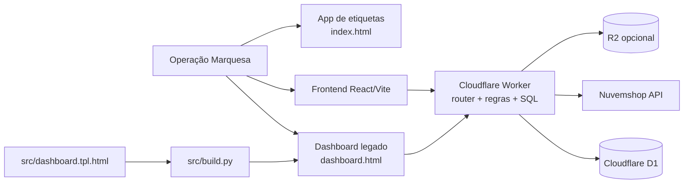
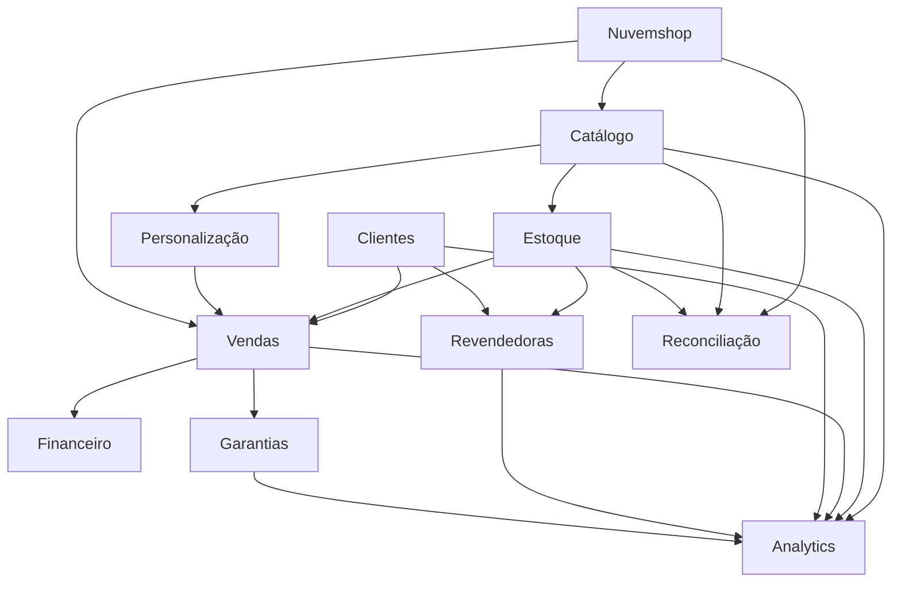
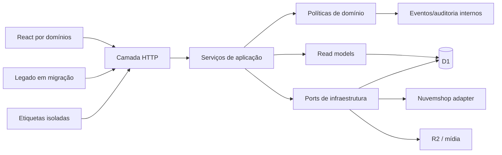

# Plano Mestre de Arquitetura — Sistema Marquesa

**Data de referência:** 2026-09-09

**Natureza:** diagnóstico e plano de evolução; não é uma autorização de implementação

**Baseline auditado:** `69ac8ac975c5ce8b7043fa346db64b1f9b5271fc` (`69ac8ac`)

**Ambiente validado:** código local e evidências versionadas; nenhum acesso ou write em PROD

**Estado do documento:** proposta para aprovação humana

**Última auditoria de progresso:** 2026-09-11 — ver §2 (o que mudou desde o
baseline) e §30 (Fase 4.4/4.5).

**Acompanhamento operacional diário:** este plano continua sendo o roteiro
estrutural. O estado corrente de cada tarefa, tarefa por tarefa, com ID
estável, mora em `docs/project/PROJECT-STATUS.md`; o histórico de execução
de cada agente em `docs/project/WORKLOG-CLAUDE.md` e
`docs/project/WORKLOG-CODEX.md`; a paridade funcional legado × sistema novo
em `docs/project/LEGACY-PARITY-AUDIT.md`. Este documento não deve virar
diário operacional — mudanças de progresso rotineiro vão para lá, não aqui.

---

## 1. Resumo executivo

O Marquesa está funcional, publicado e protegido por invariantes de negócio maduras, mas sua estrutura de código cresceu por acumulação. O problema principal não é ausência de capacidade: é a concentração de responsabilidades em poucos artefatos, sobretudo `api/src/index.js` e `src/dashboard.tpl.html`, combinada com contratos implícitos entre API, dashboard legado, frontend React, D1 e Nuvemshop.

A recomendação é uma evolução incremental por domínios, sem reescrita total, sem alteração simultânea de arquitetura e experiência visual e sem mudança de schema como ponto de partida. A API deve preservar o Worker e suas rotas públicas enquanto separa transporte HTTP, regras de negócio, persistência D1 e integrações. O frontend React deve adotar fatias verticais por domínio e substituir o legado área por área, mantendo compatibilidade até haver prova de paridade. O banco deve continuar sendo evoluído por migrations aditivas, com um manifesto confiável do que foi aplicado em cada ambiente.

O primeiro ciclo de implementação recomendado é exclusivamente de baseline e governança técnica: inventário de contratos, manifesto de schema/migrations, runner unificado de testes, atualização do Graphify Lite e definição das provas de regressão. Ele não muda comportamento, dados ou deploy. Só depois desse gate deve começar a extração do roteador.

Este plano separa explicitamente:

- **refatoração estrutural:** preservar comportamento e contratos;
- **redesign:** alterar apresentação e experiência depois da estrutura estabilizada;
- **novas funcionalidades:** somente após a refatoração aprovada, incluindo Pacote 5 e qualquer escrita externa nova.

## 2. Baseline oficial e fatos pós-release

O plano usa como fonte operacional corrente o conjunto de handoffs, baselines dos Pacotes 0–4, decisões atuais, código em `main` e testes executados nesta auditoria.

| Referência | Valor |
|---|---|
| Checkpoint final de `main` | `69ac8ac975c5ce8b7043fa346db64b1f9b5271fc` |
| Release funcional publicada | `3176a9f` |
| Consolidação dos pacotes | `6715492` |
| Governança production-first | `053e4f0` |
| Produtos validados em PROD | 790 |
| Movimentos validados em PROD | 1.428 |
| Vendas validadas em PROD | 19 |
| Divergências de saldo | 0 |
| Foreign keys quebradas | 0 |
| IDs externos duplicados | 0 |

Duas migrations foram aplicadas no release registrado: Pacote 2 e publicação de catálogo, após export e bookmark. Isso não significa que todo o conteúdo de `api/schema.sql` esteja instalado em PROD. A diferença entre schema desejado e schema efetivamente aplicado precisa passar a ser um artefato verificável.

As restrições desta fase permanecem absolutas: não executar reset, seed, importação DEV, sync destrutivo, escrita automática nova na Nuvemshop, deploy, migration ou operação em PROD.

### Atualizações desde o baseline (auditoria de 2026-09-11)

O baseline permanece `69ac8ac`. A tabela abaixo registra o que aconteceu
depois dele — não altera os fatos do release nem os números acima.

| Quando | O que aconteceu | Onde | Efeito neste plano |
|---|---|---|---|
| 09/09/2026 | Categoria "sorteio" (saída sem faturamento) implementada em schema, regras e código | commits `8055732`, `ae81c5b` | Fase 5 (§31) já recebeu "custo histórico corrigível por evento auditável" |
| 09–10/09/2026 | Criada área permanente de intake de produto/UX (`docs/ux/`) e inventário de telas/paridade React (`docs/ui/`) | commits `1d86337`, `1844739` | nova categoria de documentação fora da taxonomia de §16; ver nota lá |
| 10–11/09/2026 | Preenchido o esqueleto de `docs/ux/` com regras, estados, métricas, fluxos e mapeamento reais para Estoque, Vendas, Personalização e Catálogo/Publicação; mapa completo da Fase 4.5 (10 telas conceituais, 4 fluxos, matriz UX↔API) | working tree desta sessão, ainda não commitado nesta branch | detalhado em §30 |
| 10–11/09/2026 | Ao desenhar a Fase 4.5, identificada a ausência de contrato de criação de produto (cadastro) no domínio Catálogo | idem | pendência nova em §50; detalhe em §30 |
| 11/09/2026 (tarde) | **Decisão de arquitetura: a reconstrução passa a ser uma linha V2 separada, cujo único destino é o DEV.** `main` deixa de ser o alvo de integração enquanto durar a reconstrução | instrução humana explícita desta data | muda o destino das fases, não o conteúdo delas — ver nota abaixo |
| 11/09/2026 (tarde) | Os 75 commits de `claude/refactor-sistema-marquesa` (Fases 1–3, SKU, Monte seu Colar, Inventário 4.4, Catálogo 4.5) reconciliados e integrados na linha da V2 em 9 lotes testados | merges `B1`–`B9`; `ARQ-005` no PROJECT-STATUS | as Fases 1–3 saem de "existe numa branch" para "integrado e provado", sem sair de "fora de produção" |
| 11/09/2026 (tarde) | Painel visual do projeto gerado dos próprios documentos, publicado junto ao DEV em `/projeto/` | `docs/project/dashboard/`, `DOC-003` | acompanhamento deixa de depender de conversa |

Nenhuma destas entradas altera o baseline auditado, o estado de PROD ou
autoriza deploy. Documentação e desenho não avançam gate de release.

**Nota sobre o destino da V2 (11/09/2026).** Este plano descreve *o que* se
constrói e *em que ordem*. A partir desta data, *para onde* isso vai tem uma
regra própria, e ela é mais forte que qualquer fase daqui: **PROD está
congelada para a reconstrução.** Toda integração converge para o DEV
(`marquesa-dev.pages.dev` + `marquesa-api-staging` + `marquesa-db-dev`).
Uma fase concluída nesta V2 chega, no máximo, ao degrau `DEV` da escada de
paridade — nunca a `PROD`. Só correção crítica autorizada nominalmente pelo
Gustavo toca produção enquanto isso valer; o quando dessa liberação é a
decisão `DR-013`.

## 3. Método e fontes da auditoria

A análise seguiu a precedência atual do projeto: Canonical e Estado Atual, decisões, Domain Notes, Graphify Lite e, então, código diretamente relacionado. O grafo RAW não foi necessário.

O Graphify Lite disponível referencia o commit `2e5aaf1e`, anterior a mudanças materiais em API, analytics, pendências, personalização, publicação, schema, frontend e testes. Por isso, foi usado apenas para localização inicial. Toda conclusão relevante foi confrontada com o código do baseline atual.

Foram executadas as seguintes provas locais:

- governança versionada: 27/27;
- proteção production-first: 23/23;
- frontend: 16 arquivos e 190 testes aprovados;
- build do frontend: aprovado, 96 módulos;
- build do dashboard legado: aprovado, artefato com 976.351 bytes;
- execução de `api/schema.sql` em SQLite local em memória: 40 tabelas, 90 índices explícitos, 57 foreign keys e `integrity_check` aprovado.

Nenhuma consulta aos dados de PROD foi feita nesta auditoria. Os números de produção acima vêm da evidência oficial do release.

## 4. Estado atual do sistema

O sistema é uma composição de quatro superfícies principais:

1. dashboard operacional legado, gerado a partir de um template HTML grande;
2. frontend React/Vite em expansão, já cobrindo estoque, maletas, Nuvemshop, reconciliação, revendedoras e busca global;
3. Cloudflare Worker com D1 e integrações, organizado por arquivos funcionais, mas ainda centralizado no roteador;
4. aplicação de etiquetas estática, coexistindo na raiz do projeto.

Há ainda artefatos gerados na raiz e documentação histórica que participam do processo de operação. O sistema não está “sem arquitetura”: ele tem invariantes fortes, módulos de API, testes e políticas de segurança. O desafio é alinhar fronteiras técnicas com as fronteiras reais do negócio.

## 5. Arquitetura atual



Características observadas:

- `src/dashboard.tpl.html` concentra HTML, CSS, estado, renderização e regras de apresentação em 13.941 linhas e aproximadamente 472 funções declaradas;
- `api/src/index.js` possui 2.427 linhas, cerca de 141 decisões de rota e acesso D1 direto, além de regras de estoque, vendas, maletas e importação;
- a API tem 36 arquivos JavaScript e aproximadamente 18 mil linhas, com módulos relevantes já extraídos;
- `GET /api/state` agrega múltiplos conjuntos em paralelo e funciona como contrato amplo do dashboard;
- autenticação é um bearer compartilhado armazenado localmente, suficiente para a operação interna atual, mas sem identidade individual;
- o estoque mantém `produtos.qtd` materializado e um razão em `movimentos`; o código evita atualização direta do saldo fora da função responsável pelo razão;
- Nuvemshop já possui freios, matching de SKU, idempotência e separação entre leitura e escrita;
- o frontend React já é uma segunda aplicação operacional, não apenas um protótipo.

## 6. Diagnóstico dos problemas arquiteturais

### Urgentes

1. **Verdade do schema por ambiente.** Não existe um ledger versionado e consultável que prove quais migrations estão aplicadas em cada ambiente. `schema.sql` representa a instalação limpa desejada, não necessariamente PROD.
2. **Contratos implícitos.** Rotas, formatos JSON, estados e efeitos colaterais são validados por muitos testes, mas não há inventário único ou contract suite que proteja a extração estrutural.
3. **Configuração agendada ambígua.** O Worker exporta um handler `scheduled`, enquanto `api/wrangler.toml` registra `crons = []`. Documentos anteriores descrevem execução periódica. O estado implantado deve ser verificado antes de qualquer mudança em sync.
4. **Documentação arquitetural defasada.** Documentos ainda citam um dashboard de 3.802 linhas, 16 tabelas e cobertura anterior aos Pacotes 1–4.

### Importantes

1. **Roteador como núcleo de aplicação.** Transporte, validação, regra, SQL e integração ainda se cruzam em `index.js`.
2. **Dashboard legado monolítico.** Alterações pequenas atravessam estado global, DOM, CSS e regra de apresentação no mesmo arquivo.
3. **API agregada ampla.** `/api/state` é conveniente, mas aumenta acoplamento, volume e risco de quebra indireta.
4. **Testes fragmentados.** Há ampla cobertura, porém sem comando raiz único, taxonomia executável e manifesto de regressão por domínio.
5. **Portabilidade do build.** Scripts assumem `python3` e shell Unix, apesar de o workspace corrente ser Windows.
6. **Erros internos.** O fallback genérico da API pode devolver detalhes internos ao cliente autenticado; deve haver política de erro consistente sem perder diagnóstico operacional.
7. **Semântica de dados distribuída.** Dinheiro, datas, status e snapshots JSON têm convenções diferentes entre módulos antigos e novos.

### Futuras

1. medir e dividir o bundle principal do React, hoje em torno de 629 kB minificado e 206 kB gzip;
2. avaliar índices D1 somente com métricas e planos de consulta;
3. versionar payloads JSON persistidos;
4. adicionar identidade individual, RBAC e trilha de ator caso o uso deixe de ser exclusivamente interno;
5. avaliar contratos gerados apenas quando houver ganho comprovado entre consumidores.

### Legado aceitável

1. saldo materializado em `produtos.qtd`, desde que reconciliado com `movimentos`;
2. duplicação deliberada entre dados históricos brutos, projeções e decisões duráveis;
3. snapshots JSON usados para preservar contexto histórico;
4. foreign keys com `NO ACTION`, coerentes com a política de não apagar histórico;
5. dashboard legado durante a migração incremental;
6. bearer compartilhado enquanto o produto continuar interno, com segredo protegido e sem pretensão SaaS.

## 7. Domínios reais do negócio

| Domínio | Responsabilidade própria | Não deve possuir |
|---|---|---|
| Plataforma | HTTP, autenticação, configuração, erros, observabilidade | regra comercial |
| Catálogo | produtos, categorias, SKU, fotos, publicação interna | saldo de estoque |
| Estoque | razão, saldo, variações, kits, inventário | venda ou cliente |
| Vendas | venda operacional, itens, pagamento, cancelamento | cadastro mestre de cliente |
| Clientes | identidade, vínculo, histórico de relacionamento | cálculo de saldo |
| Financeiro | recebíveis, liquidação e projeções financeiras | mutação autônoma da venda |
| Revendedoras | maletas, consignação, acerto, comissão | regra genérica de estoque |
| Garantias | garantia, eventos, troca | venda original como entidade própria |
| Personalização | modelos, opções e composição configurável | venda concluída ou publicação externa |
| Nuvemshop | transporte externo, pedido, variante, sincronização | decisão local de negócio |
| Reconciliação | comparação, sessão, itens e correção controlada | fonte primária do saldo |
| Analytics | read models, indicadores e agregações | comandos de negócio |
| Etiquetas | composição e impressão de etiquetas | operação do dashboard |

`pendencias` deve ser tratado como projeção transversal de leitura. Não é um domínio com autoridade para alterar estoque, venda ou catálogo.

## 8. Mapa de dependências de negócio



As setas indicam consumo de contrato, não permissão para escrever diretamente na tabela do outro domínio. Comandos cruzados devem passar por serviços de aplicação explícitos.

## 9. Árvore atual relevante

```text
Marquesa-Etiquetas/
├── api/
│   ├── migrations/
│   ├── src/
│   │   ├── index.js
│   │   ├── state.js
│   │   ├── analytics.js
│   │   ├── sync.js
│   │   ├── reconciliacao.js
│   │   ├── vendas-historico.js
│   │   └── ...
│   ├── schema.sql
│   ├── schema-console.sql
│   └── wrangler.toml
├── frontend/
│   └── src/
│       ├── app/
│       ├── components/
│       ├── features/
│       ├── services/
│       └── domain/
├── src/
│   ├── dashboard.tpl.html
│   ├── build.py
│   └── testes *.mjs
├── docs/
├── dashboard.html
├── index.html
├── manifest.json
└── sw.js
```

Essa disposição mistura fontes, artefatos de deploy, testes e aplicações distintas. Ela não deve ser reorganizada de uma vez, porque caminhos de Pages, service worker e build podem depender da raiz atual.

## 10. Auditoria do frontend legado

O dashboard legado é o maior hotspot estrutural. Seu tamanho não é, sozinho, o defeito; o risco vem da combinação de estado global, renderização manual, navegação, cache local, regras de visualização e chamadas à API no mesmo artefato.

Pontos fortes que precisam ser preservados:

- comportamento operacional conhecido;
- cobertura por testes de regressão e capturas dos pacotes;
- baixo número de dependências de runtime;
- wrapper de API que reduz fetches espalhados;
- possibilidade de build estático simples.

Plano específico:

1. congelar o legado como referência comportamental;
2. impedir entrada de grandes funcionalidades novas nele, salvo correção crítica;
3. criar uma matriz “tela → rota → estado → regra → teste”;
4. migrar áreas completas para React, nunca funções isoladas sem fronteira visível;
5. manter links ou entrypoints de compatibilidade durante a transição;
6. retirar o legado somente após paridade, uso real e janela de observação em produção.

Não é recomendável modularizar internamente as 13.941 linhas como destino final. Extrações pequenas podem ajudar a reduzir risco, mas o investimento principal deve ir para a aplicação React.

## 11. Auditoria do frontend React

O React já contém capacidade operacional relevante e possui 190 testes verdes. A organização atual por `features`, `components`, `services` e `domain` é um bom início, mas tende a espalhar uma única área de negócio por várias árvores.

Direção proposta:

- fatias verticais por domínio em `src/domains`;
- `src/app` apenas para shell, navegação e composição;
- `src/shared` somente para UI, cliente HTTP, tipos técnicos e utilitários sem negócio;
- chamadas HTTP encapsuladas por domínio;
- tipos de resposta junto ao consumidor, protegidos por contract tests;
- read models explícitos para telas amplas;
- lazy loading para áreas pesadas, especialmente fluxos que usam XLSX;
- parâmetros de planejamento com uma fonte de verdade definida, evitando divergência entre `localStorage` e configuração da API.

Não há necessidade imediata de adotar uma biblioteca de rotas. Ela passa a fazer sentido se deep links, histórico de navegação, permissões por página ou carregamento por rota se tornarem requisitos concretos.

## 12. Auditoria do backend

A API já tem módulos especializados, mas `index.js` continua sendo o ponto de decisão de rota e também contém lógica de aplicação e SQL. A extração deve usar o padrão strangler: rotas são movidas uma a uma, mantendo URL, método, payload, status HTTP e efeitos.

Fronteiras desejadas:

- **handler HTTP:** autentica, valida entrada, converte resposta e erro;
- **serviço de aplicação:** coordena caso de uso e transação possível;
- **política de domínio:** concentra invariantes e decisões puras;
- **queries/commands D1:** SQL próximo ao domínio proprietário;
- **adapter externo:** Nuvemshop, R2 e outros serviços;
- **read model:** consultas transversais sem autoridade de escrita.

Não criar um repositório genérico universal. D1 e SQLite têm semântica concreta e o SQL legível junto ao domínio é preferível a uma abstração que esconda transações, constraints e custo.

## 13. Auditoria do banco D1

O schema limpo atual possui 40 tabelas, 90 índices explícitos e 57 foreign keys. Há um núcleo antigo mais permissivo e tabelas recentes com `CHECK`s mais fortes. Essa diferença é histórica e não justifica reconstrução imediata das tabelas antigas.

### Invariantes que não podem mudar

- `movimentos` é o razão de estoque;
- `produtos.qtd` é saldo materializado e só muda pela operação central do razão;
- saldo materializado deve reconciliar com movimentos;
- IDs externos e chaves de idempotência continuam únicos onde definidos;
- histórico financeiro e operacional não é apagado por cascata;
- snapshots preservam o contexto conhecido no momento da operação;
- alterações de schema em dados reais são incrementais, revisadas e reversíveis no plano operacional.

### Problemas a tratar

1. criar ledger de migrations aplicadas, com checksum e ambiente;
2. versionar ordem canônica e pré-condições das migrations existentes;
3. separar migrations de avanço e scripts manuais de rollback destrutivo;
4. comparar schema desejado, DEV e PROD antes de qualquer pacote que dependa de tabela nova;
5. documentar unidades de dinheiro: valores reais nas vendas operacionais e centavos onde usados em históricos;
6. documentar timezone e normalização de datas;
7. adicionar validações no serviço antes de cogitar rebuild SQLite para novos `CHECK`s;
8. medir índices redundantes antes de removê-los;
9. versionar formatos JSON persistidos quando passarem por mudança.

`migracao-publicacao-catalogo-rollback.sql` contém operações destrutivas legítimas para recuperação manual. Deve ser isolado em pasta de rollback, claramente marcado e nunca incluído num runner automático.

## 14. Auditoria da integração Nuvemshop

A integração é uma fronteira de alto risco porque combina estado externo, variante, SKU, estoque absoluto e pedido. Os freios atuais devem permanecer como requisitos arquiteturais, não detalhes de implementação.

Regras obrigatórias:

- escrita externa desabilitada por padrão fora do ambiente explicitamente autorizado;
- dry-run antes de operações mutáveis em lote;
- pedidos recebidos e contabilizados antes de qualquer push de saldo relacionado;
- matching inequívoco de SKU e variante;
- saldo enviado de forma absoluta, não por delta acumulado;
- idempotência de pedidos e execuções;
- falha fechada diante de SKU desconhecido, variante órfã ou configuração ambígua;
- auditoria de cada execução e resumo de efeitos;
- nenhum cron presumido apenas porque existe handler no código;
- publicação interna de catálogo não equivale a publicação externa na loja.

Na arquitetura-alvo, o adapter Nuvemshop traduz HTTP externo. A orquestração de sync pertence a um serviço de aplicação. Estoque e vendas continuam decidindo seus próprios comandos locais.

## 15. Auditoria de testes

O projeto tem três famílias principais:

1. testes customizados em `src`, cobrindo regras, migrations, Worker com D1 local, integração fake, Playwright e regressões;
2. testes unitários e de componentes no frontend, hoje 190 aprovados;
3. gates de governança e proteção production-first.

O problema é a descoberta e execução, não a ausência de testes. `api/package.json` não oferece runner útil; `src/package.json` depende de comandos Unix; não existe uma entrada raiz que represente o gate do sistema.

Estratégia proposta:

- manifesto versionado com cada suíte, domínio, duração e pré-requisitos;
- runner raiz seguro, que não acesse PROD e não dependa de shell específico;
- níveis `fast`, `domain`, `integration`, `browser` e `release`;
- contract tests das rotas antes de extraí-las;
- fixtures mínimas versionadas por invariante, não cópias de dados reais;
- testes de dupla execução para idempotência;
- reconciliação de saldo obrigatória nos gates de estoque, venda, cancelamento e maleta;
- snapshots semânticos de JSON, ignorando campos voláteis;
- matriz de paridade legado/React por fluxo;
- orçamento explícito de flakiness: teste instável é defeito, não evidência de aprovação.

## 16. Auditoria da documentação

A documentação é rica, porém mistura fontes canônicas, planos antigos, handoffs, auditorias, runbooks e evidências na mesma camada. Alguns números e estados já estão desatualizados.

Taxonomia proposta:

```text
docs/
├── README.md                 # índice e precedência
├── architecture/             # arquitetura atual, alvo e decisões técnicas
├── domains/                  # regras e contratos por domínio
├── operations/               # deploy, backup, DEV, incidentes
├── decisions/                # ADRs vigentes
├── releases/                 # handoffs e baselines imutáveis
├── testing/                  # estratégia, matriz e execução
└── archive/                  # planos e relatórios substituídos
```

Ações futuras, sem apagar evidência:

- substituir números defasados em `ARCHITECTURE.md`, `FRONTEND_ARCHITECTURE.md`, `DATA_MODEL.md`, `TESTING.md` e `README.md`;
- marcar `PLANO-MESTRE-MARQUESA.md` como plano histórico anterior ao go-live, apontando para este documento;
- mover handoffs e baselines datados para `releases` preservando conteúdo e histórico Git;
- mover relatórios de go-live, readiness e fechamento para `releases` ou `archive`;
- agrupar runbooks Windows/WSL, D1 e deploy em `operations`;
- manter regras de negócio e segurança como fontes canônicas, com cabeçalho de precedência;
- registrar decisões humanas pendentes sem transformá-las em regra por inferência;
- reconhecer `docs/ux/` (regras, estados, métricas e fluxos por tela) e
  `docs/ui/` (inventário de telas e paridade legado/React) como categoria de
  produto/UX criada em 09/2026 (`1d86337`, `1844739`), fora desta taxonomia
  original; decidir depois se ela se funde a `domains/` ou permanece
  paralela, sem duplicar telas por falta de leitura cruzada entre as duas.

## 17. Auditoria da governança Codex e memória

A governança local tem bons hard-denies, testes dedicados e precedência explícita. O Production Release Approval histórico foi revogado; a política corrente é production-first com bloqueios claros. Essa verdade não pode ser reintroduzida por documento, skill ou hook antigo.

Riscos atuais:

- Canonical privado de segurança ainda contém linguagem antiga em conflito com Estado Atual, decisão corrente e `docs/SECURITY.md`;
- Graphify Lite está atrás do baseline atual;
- arquivos locais `.codex` e `.agents` podem divergir dos versionados e não devem ser tratados automaticamente como fonte de produto;
- o vault privado não pode ser copiado ou versionado neste repositório.

Direção:

- manter testes de governança como gate obrigatório;
- registrar a fonte prevalente em toda documentação operacional;
- atualizar memória e grafo após mudanças arquiteturais aprovadas;
- evitar que automações façam deploy, migration ou escrita real por consequência implícita;
- manter separação entre memória privada, documentos versionados e artefatos locais de ferramenta.

## 18. Estratégia para o legado

O legado será administrado em quatro estados:

| Estado | Significado | Regra |
|---|---|---|
| Referência | implementação atual define comportamento observado | proteger com caracterização |
| Congelado | recebe apenas correções críticas | nenhuma feature ampla |
| Substituído | fluxo React provou paridade | manter fallback por janela definida |
| Retirável | sem uso e com rollback conhecido | remover em mudança separada |

Não haverá “big bang”. A retirada de um fluxo exige evidência de equivalência funcional, operação real, telemetria suficiente e aprovação humana.

## 19. Princípios da arquitetura-alvo

1. preservar invariantes antes de mover arquivos;
2. uma autoridade de escrita por domínio;
3. SQL explícito e próximo do domínio proprietário;
4. integrações externas atrás de adapters;
5. queries transversais são read models, não atalhos de escrita;
6. rotas públicas permanecem compatíveis durante a refatoração;
7. cada fase é implantável e reversível de forma independente;
8. nenhuma migration é consequência automática de refatoração;
9. duplicação pequena é preferível a abstração compartilhada prematura;
10. métricas precedem otimização de D1, bundle ou cache;
11. documentação e testes são parte do contrato;
12. estrutura, redesign e feature têm trilhas distintas.

## 20. Arquitetura-alvo



O desenho não exige framework de injeção, event bus distribuído, microserviços ou monorepo de pacotes. São módulos dentro do mesmo Worker e aplicações estáticas, com dependências explícitas e testáveis.

## 21. Árvore-alvo proposta

```text
Marquesa-Etiquetas/
├── api/
│   ├── src/
│   │   ├── worker.js
│   │   ├── http/
│   │   │   ├── router.js
│   │   │   └── routes/
│   │   ├── platform/
│   │   │   ├── auth.js
│   │   │   ├── config.js
│   │   │   ├── errors.js
│   │   │   ├── observability.js
│   │   │   └── d1/
│   │   ├── domains/
│   │   │   ├── catalogo/
│   │   │   ├── estoque/
│   │   │   ├── vendas/
│   │   │   ├── clientes/
│   │   │   ├── financeiro/
│   │   │   ├── revendedoras/
│   │   │   ├── garantias/
│   │   │   ├── personalizacao/
│   │   │   ├── nuvemshop/
│   │   │   ├── reconciliacao/
│   │   │   └── analytics/
│   │   └── shared/
│   ├── migrations/
│   │   ├── README.md
│   │   ├── forward/
│   │   └── rollback-manual/
│   └── tests/
├── frontend/
│   └── src/
│       ├── app/
│       ├── domains/
│       └── shared/
├── legacy-dashboard/
│   └── dashboard.tpl.html
├── etiquetas/
│   └── ...
├── tests/
│   ├── contracts/
│   ├── regression/
│   └── fixtures/
├── scripts/
└── docs/
```

Essa é uma árvore de destino. As raízes e artefatos atuais de deploy devem permanecer por wrappers ou cópias geradas até que Pages, service worker e processo operacional sejam ajustados e provados em mudança separada.

## 22. Desenho interno do backend-alvo

Cada domínio pode conter apenas os arquivos que justificar:

```text
estoque/
├── service.js       # casos de uso
├── policy.js        # invariantes puras
├── queries.js       # leituras D1
├── commands.js      # escritas D1
├── dto.js           # fronteira serializada, se necessária
└── service.test.js
```

Não é uma estrutura obrigatória para módulos pequenos. O critério é tornar visíveis quatro perguntas: quem decide, quem persiste, quem orquestra e qual contrato sai pela rota.

Erros devem ser classificados em validação, conflito de domínio, dependência externa, configuração e falha interna. O cliente recebe código estável e mensagem segura; logs recebem contexto técnico sem segredo.

## 23. Desenho interno do frontend-alvo

Uma fatia vertical deve agrupar página, componentes, hooks, serviço HTTP, tipos e testes do mesmo domínio:

```text
domains/estoque/
├── pages/
├── components/
├── api/
├── model/
└── tests/
```

`shared` não deve conhecer “maleta”, “comissão”, “garantia” ou “SKU reservado”. Se conhece, pertence a um domínio ou a um contrato explicitamente compartilhado.

O shell controla navegação, conexão e tratamento de erro global. Cada área controla seus estados de carregamento, vazio, erro recuperável e confirmação de comandos. Respostas agregadas podem continuar existindo enquanto úteis, mas suas dependências devem ser documentadas.

## 24. Contratos entre camadas

Antes de mover uma rota, registrar:

- método e path;
- autenticação;
- request body e query;
- resposta de sucesso;
- códigos de erro conhecidos;
- tabelas lidas e escritas;
- invariantes acionadas;
- efeitos externos;
- consumidores;
- testes que provam o contrato.

Os DTOs devem ser estáveis nas bordas. Objetos internos podem evoluir. A geração automática de tipos não é requisito inicial: primeiro é preciso descobrir e estabilizar o contrato real.

## 25. Separação entre refatoração, redesign e novas funcionalidades

### Trilha A — refatoração estrutural

Pode mover código, criar módulos, runners, contratos e observabilidade. Não pode mudar regra de negócio, aparência intencional, schema por conveniência ou comportamento de integração.

### Trilha B — redesign

Começa apenas quando a área correspondente tiver fronteiras e testes estáveis. Pode alterar layout, hierarquia, navegação e componentes visuais, com validação de uso e acessibilidade. Não deve esconder mudança de regra.

### Trilha C — novas funcionalidades

Inclui Pacote 5, publicação externa de catálogo, novas automações e capacidades SaaS. Cada feature recebe sua própria decisão, modelo de risco e, se necessário, migration. Não entra como “aproveitamento” de uma refatoração.

## 26. Fase 0 — congelar e provar o baseline

**Objetivo:** tornar o comportamento atual mensurável antes de alterar estrutura.

Entregas:

- inventário de rotas e contratos;
- matriz tela/rota/regra/tabela/teste;
- manifesto de suites e runner raiz seguro;
- manifesto de schema e migrations por ambiente, sem aplicar nada;
- registro explícito da configuração de cron implantada;
- Graphify Lite atualizado para o baseline aprovado;
- baseline de bundle, build e testes;
- ADR da estratégia incremental.

Gate: todos os testes atuais verdes, nenhuma mudança funcional, nenhuma operação em PROD e diff restrito a documentação, testes de caracterização e scripts seguros.

Rollback: reverter o commit da fase; não há dado ou deploy a desfazer.

## 27. Fase 1 — consolidar documentação e governança

**Objetivo:** estabelecer fonte de verdade navegável.

Entregas:

- índice de documentação;
- taxonomia `architecture/domains/operations/releases/archive`;
- cabeçalhos de vigência e substituição;
- atualização de contagens e estados defasados;
- harmonização da segurança privada e versionada conforme a precedência atual;
- registro das decisões humanas pendentes.

Gate: links validados, documentos históricos preservados, testes de governança verdes.

## 28. Fase 2 — extrair o shell HTTP

**Objetivo:** reduzir `index.js` sem mover ainda as regras centrais.

Sequência:

1. criar `worker.js`, router e formato de resposta/erro compatível;
2. extrair health, configuração e rotas somente leitura simples;
3. extrair rotas por domínio mantendo chamadas às funções existentes;
4. por último, mover rotas mutáveis e callbacks externos.

Gate por rota: contract test antes e depois, mesmo status, corpo, headers e efeitos D1. O handler `scheduled` permanece funcional e inalterado.

Rollback: roteador antigo continua disponível no commit anterior; nenhuma migration.

## 29. Fase 3 — plataforma e adapters

**Objetivo:** centralizar capacidades técnicas sem centralizar negócio.

Entregas:

- autenticação e CORS;
- configuração tipada e validação fail-closed;
- política de erros e logs;
- helpers D1 mínimos;
- cliente Nuvemshop e adapter de mídia;
- correlação de execução para sync, importação e reconciliação.

Gate: testes de segurança, erros, secrets ausentes e integração fake.

## 30. Fase 4 — estoque e catálogo

**Objetivo:** estabelecer primeiro as invariantes mais críticas.

Ordem:

1. razão e saldo;
2. variações e SKU;
3. kits;
4. inventário;
5. categorias, fotos, modelos de personalização e publicação interna;
6. importações relacionadas.

Gate: nenhuma escrita direta em `produtos.qtd`, reconciliação zero, idempotência, kits/variações e caracterização das rotas. Mudanças de schema, se realmente necessárias, são propostas separadamente e não fazem parte automática desta fase.

### Progresso registrado nos itens 4 e 5 (auditoria de 2026-09-11)

Os itens 4 e 5 da ordem acima estão sendo trabalhados numa branch paralela
(`claude/refactor-sistema-marquesa`) sob os rótulos externos "Fase 4.4"
(inventário) e "Fase 4.5" (categorias, fotos, personalização e publicação
interna). A numeração decimal identifica fase e item desta lista — não é uma
fase nova nem substitui esta seção. Nenhuma das duas está mesclada ou
implantada.

| Rótulo externo | Item desta lista | Estado auditado |
|---|---|---|
| Fase 4.4 | 4 — inventário | aprovada e provada na trilha paralela; sem deploy |
| Fase 4.5 | 5 — categorias, fotos, personalização e publicação interna | contrato de API implementado e provado na trilha paralela (`docs/domains/CONTRATO-UX-API-4-5.md`), sem deploy; UX mapeada nesta branch em `docs/ux/03-screens/catalogo/` e `docs/ux/05-flows/catalogo-*.md` (10 telas conceituais, 4 fluxos); React não iniciado; escrita real na Nuvemshop desligada por padrão em todos os ambientes (`NUVEMSHOP_PUBLICACAO_ENABLED` ausente) |

Achado da auditoria de 2026-09-11, independente desta ou de qualquer
branch: **R2 não está habilitado em nenhum ambiente de produção**
(`api/wrangler.toml` só declara o binding `FOTOS` em `[env.staging]`). Isso
bloqueia estruturalmente toda escrita de foto própria — 158 das 160 peças
ainda fora da loja não têm imagem em lugar nenhum, então "puxar da loja"
não resolve. O código já responde a essa ausência com `503 { bloqueio:
"sem_r2" }` em vez de erro — a trava está certa, falta o bucket. Ver
`docs/project/LEGACY-PARITY-AUDIT.md` § "Legacy gaps discovered" item 1.

O contrato da Fase 4.5 já formaliza os freios que a §50 deixava em aberto
para "publicação externa de catálogo": chamadas secas por padrão, prévia com
payload exato, aprovação humana obrigatória antes de publicar, rodada
pausada acima de 20 itens aprovados, e a flag de ativação ausente em todo
ambiente. Falta decidir a ativação em produção (§50 permanece aberta nesse
ponto).

**Lacuna descoberta ao desenhar a Fase 4.5: cadastro de produto.**

- Hoje existe uma tela real e em produção de cadastro: o dashboard legado
  (`src/dashboard.tpl.html`, aba "Cadastro de Produtos"), cadastro manual ou
  em lote, gravando por `/api/produtos/novos/analisar` →
  `/api/produtos/novos/cadastrar`. Essa rota vive no domínio Estoque/
  Importação (skill `marquesa-safe-import`), não num domínio "Catálogo" —
  cadastrar uma peça à mão é tratado como o mesmo caso de "peça nova" da
  importação em lote.
- O espelho técnico da Fase 4.5 documenta leitura/edição de produto já
  existente (variações, dependências, categoria, galeria) e publicação, mas
  **não expõe rota de criar produto**. A documentação UX registrou isso
  explicitamente em vez de inventar uma rota
  (`docs/ux/03-screens/catalogo/api-needs.md` § "Lacuna deliberada do
  espelho"; `docs/ux/05-flows/catalogo-cadastrar-e-completar-produto.md`;
  pendência `CAT-Q006` em `docs/ux/03-screens/catalogo/open-questions.md`).
- Este plano nunca previu uma tela própria de cadastro dentro do domínio
  Catálogo: o item 5 acima presume que o produto já existe. O cadastro
  sempre morou no fluxo de Estoque/Importação, fora do escopo aqui descrito.
  Não é um esquecimento desta fase — é uma fronteira de domínio nunca
  decidida, que só ficou visível ao desenhar a tela "Cadastro/edição de
  produto" da Fase 4.5.
- **Decisão que falta** (registrada em §50): manter a criação de produto
  exclusiva do fluxo de importação/Estoque, ou dar ao domínio Catálogo sua
  própria rota de criação. Enquanto isso não for decidido, a Fase 4.5 não
  deve ser considerada com o fluxo de produto completamente desenhado, e a
  publicação na Nuvemshop não substitui o cadastro interno do produto.

## 31. Fase 5 — vendas, clientes, financeiro e garantias

**Objetivo:** separar o ciclo comercial mantendo histórico e valores.

Entregas:

- venda, item, pagamento e cancelamento;
- composição personalizada persistida na venda, sem duplicar a autoridade dos modelos de catálogo;
- identidade de cliente e vínculo ambíguo;
- recebíveis como caso de uso/read model explícito;
- garantias, trocas e eventos;
- histórico bruto, projeções e correções com ownership documentado;
- custo histórico corrigível por evento auditável (valor anterior/novo,
  motivo, autor e data), sem sobrescrever o bruto nem confundir preço de venda
  com custo.

Gate: fixtures de dinheiro e datas, venda/cancelamento, idempotência externa, histórico imutável e dupla execução.

## 32. Fase 6 — revendedoras, maletas e comissão

**Objetivo:** isolar consignação sem redefinir regras comerciais.

Antes da extração, caracterizar criação, adição, retorno, acerto, cancelamento, comissão e reflexos em estoque/financeiro. Decisões ainda abertas, como “giro”, não podem ser resolvidas pelo refactor.

Gate: mesmas quantidades, mesmos recebíveis, mesma comissão e reconciliação zero para todos os fluxos conhecidos.

## 33. Fase 7 — Nuvemshop, sync e reconciliação

**Objetivo:** separar transporte externo de decisões locais.

Entregas:

- adapter HTTP externo;
- serviço de pedido recebido;
- serviço de push de estoque absoluto;
- matching de produto/variante;
- sessões e itens de reconciliação;
- dry-run e freios como políticas testáveis;
- auditoria de execução.

Gate: loja fake, SKU desconhecido, variante órfã, reexecução, timeout parcial, escrita desabilitada e ordem pull-before-push. Não alterar cron nem habilitar escrita durante esta fase sem autorização específica.

## 34. Fase 8 — analytics e projeções transversais

**Objetivo:** transformar analytics, estado agregado e pendências em read models explícitos.

Entregas:

- consultas por painel e domínio;
- projeção de pendências sem autoridade de escrita;
- limites de tamanho e paginação onde medição justificar;
- cache somente onde houver invalidação compreensível;
- contratos menores para novas telas, mantendo `/api/state` enquanto houver consumidores.

Gate: números idênticos nos datasets de regressão, timezone e filtros caracterizados, comparação de custo D1.

## 35. Fase 9 — alinhar o React aos domínios

**Objetivo:** completar a migração estrutural da interface sem redesign amplo.

Sequência recomendada:

1. shell, conexão e busca global;
2. estoque e catálogo;
3. clientes e vendas;
4. revendedoras e maletas;
5. garantias e financeiro;
6. Nuvemshop e reconciliação;
7. analytics e pendências.

Cada área deve ser migrada como fluxo utilizável, com paridade documentada e fallback temporário.

## 36. Fase 10 — isolar etiquetas e build legado

**Objetivo:** separar as aplicações sem quebrar os entrypoints publicados.

Entregas:

- fontes da aplicação de etiquetas em diretório próprio;
- fonte do dashboard legado em diretório explícito;
- geração compatível dos artefatos na raiz;
- scripts portáveis Windows/Linux;
- documentação de Pages, service worker, manifest e cache.

Gate: URLs, assets, instalação e impressão funcionando nos mesmos entrypoints. Só depois mover ou remover artefatos de compatibilidade.

## 37. Fase 11 — aposentadoria controlada do legado

Pré-condições cumulativas:

- paridade funcional assinada por fluxo;
- nenhuma rota exclusiva desconhecida;
- janela de uso real do React sem regressão crítica;
- métricas e logs suficientes;
- fallback testado;
- runbook de rollback;
- aprovação humana explícita.

A remoção deve ocorrer em commit próprio. Não combinar retirada do legado com redesign ou nova feature.

## 38. Fase 12 — fechamento arquitetural

Entregas:

- documentos atuais sincronizados;
- grafo regenerado;
- hotspots recontados;
- débitos resolvidos, reclassificados ou aceitos com justificativa;
- artefatos históricos arquivados;
- DoD completo;
- decisão sobre início da trilha de redesign.

## 39. Estratégia de regressão

Toda fase deve provar três níveis:

1. **contrato:** HTTP, JSON, erro e efeito externo;
2. **invariante:** saldo, idempotência, dinheiro, histórico e segurança;
3. **fluxo:** usuário consegue completar a operação.

Matriz mínima:

| Área | Prova obrigatória |
|---|---|
| Estoque | razão = saldo; variação e kit; repetição segura |
| Venda | registrar, pagar, cancelar; estoque e histórico coerentes |
| Maleta | criar, adicionar, acertar e cancelar sem divergência |
| Cliente | CPF ambíguo não causa merge silencioso |
| Garantia | troca e eventos preservam origem |
| Nuvemshop | matching, pedido duplicado, write flag, saldo absoluto |
| Reconciliação | dry-run, sessão, aplicação idempotente |
| Analytics | totais e datas equivalentes |
| Frontend | loading, vazio, erro, sucesso e navegação |
| Governança | hard-denies e ausência de segredo/dado real |

## 40. Registro de riscos

| Risco | Prob. | Impacto | Mitigação |
|---|---:|---:|---|
| divergência entre schema desejado e PROD | alta | alto | ledger, checksum e preflight por ambiente |
| quebra do razão de estoque | média | crítico | extração ledger-first, testes e reconciliação |
| variante/SKU incorreto na Nuvemshop | média | crítico | fake store, matching estrito e fail-closed |
| pedido externo duplicado | média | crítico | unique key e testes de dupla execução |
| mudança silenciosa de dinheiro/data | alta | alto | fixtures, unidades documentadas e timezone explícito |
| paridade incompleta do legado | alta | alto | strangler, matriz por fluxo e fallback |
| contratos React/API não implantados | média | alto | manifesto de schema e contract tests |
| configuração de cron diferente da documentação | média | alto | verificar estado implantado antes da fase 7 |
| decisão comercial inferida no refactor | média | alto | Canonical, ADR e bloqueio humano |
| erro interno exposto ao cliente | média | médio | códigos estáveis e logs seguros |
| teste fragmentado omitido no gate | alta | médio | runner e manifesto versionados |
| script de rollback executado acidentalmente | baixa | crítico | pasta manual, hard-deny e aprovação explícita |
| build dependente de plataforma | alta | médio | scripts portáveis e CI cruzado |
| custo/latência de `/api/state` | média | médio | medição e read models incrementais |
| bundle React crescente | alta | médio | análise e lazy loading depois da estrutura |
| R2 não disponível em PROD | média | médio | capacidade opcional e fallback documentado |
| autenticação compartilhada limita auditoria | alta | médio hoje, alto em SaaS | aceitar internamente; identidade antes de expansão |
| índice D1 removido sem evidência | baixa | alto | EXPLAIN/métricas; nenhuma limpeza estética |
| Graphify/documentação desatualizados | alta | médio | atualização no início e fim das fases |

## 41. Dependências e ordem obrigatória

- Fase 0 precede qualquer movimento estrutural.
- Fase 2 precede extração profunda de domínios para evitar múltiplos roteadores informais.
- Estoque precede vendas, maletas, sync e reconciliação.
- Vendas e clientes precedem financeiro e garantias.
- Contratos backend precedem migração React da área correspondente.
- Paridade React precede aposentadoria do legado.
- Refatoração aprovada precede redesign amplo.
- Redesign não é pré-requisito para novas features, mas ambas exigem fronteiras estáveis e aprovação separada.
- Qualquer migration cria uma trilha própria de segurança, backup, validação e rollback.

## 42. Estratégia de rollback

Para fases somente de código e documentação, o rollback padrão é reverter o commit e republicar o artefato anterior validado. Mudanças devem ser pequenas o bastante para isso ser realista.

Para mudanças de dados futuras:

1. export/bookmark antes da migration;
2. migration forward aditiva por padrão;
3. compatibilidade de leitura durante a janela de transição;
4. validação de contagens, FK, saldo e duplicidades;
5. rollback operacional documentado e testado em ambiente não produtivo;
6. scripts destrutivos nunca automáticos;
7. restauração como último recurso, com decisão humana.

Para integrações externas, rollback significa desabilitar writes, preservar auditoria, interromper reexecução e reconciliar estado antes de retomar. Um `git revert` não desfaz efeito já enviado à Nuvemshop.

## 43. Candidatos a consolidação, arquivamento ou remoção

### Consolidar

- documentação de arquitetura atual e frontend;
- estratégia e comandos de teste;
- runbooks de DEV, WSL e D1;
- regras de integração espalhadas entre docs e handoffs.

### Arquivar, preservando histórico

- planos anteriores ao go-live;
- checklists e reviews de releases encerrados;
- handoffs datados;
- capturas e baselines de pacotes concluídos;
- relatórios de sessão substituídos.

### Avaliar remoção somente depois

- wrappers e entrypoints do dashboard legado;
- scripts de build não portáveis após substituição;
- código de fallback sem consumidores;
- dependências pesadas não utilizadas;
- índices comprovadamente redundantes;
- arquivos gerados rastreados, se o deploy passar a gerá-los de forma confiável.

Nenhum item desta lista está autorizado para remoção por este plano.

## 44. Hotspots prioritários

| Hotspot | Evidência | Tratamento |
|---|---|---|
| `src/dashboard.tpl.html` | 13.941 linhas, ~472 funções | congelar e substituir por área |
| `api/src/index.js` | 2.427 linhas, ~141 decisões de rota | extrair shell HTTP e casos de uso |
| `api/src/analytics.js` | 1.881 linhas | separar read models depois dos domínios |
| `api/src/sync.js` | 1.279 linhas | adapter + orquestração na fase 7 |
| `GET /api/state` | agregado de múltiplos datasets | caracterizar e dividir por medição |
| migrations | 26 arquivos sem ledger aplicado | manifesto antes de qualquer nova migration |
| testes | runners e plataformas diferentes | runner raiz e matriz |
| documentação | estados e contagens incompatíveis | taxonomia e vigência explícita |

## 45. Redesign futuro

O redesign deve começar por pesquisa operacional e inventário de tarefas, não por troca de componentes. Ordem sugerida:

1. design system mínimo e acessível;
2. navegação e hierarquia de informação;
3. estados de loading, vazio, erro e confirmação;
4. formulários críticos e prevenção de erro;
5. tabelas e filtros operacionais;
6. uso móvel e impressão;
7. consistência visual entre domínios;
8. métricas de conclusão e retrabalho.

Cada redesign deve manter os mesmos casos de uso ou declarar formalmente a mudança de produto.

## 46. Novas funcionalidades futuras

Somente após os gates estruturais relevantes:

- ~~Pacote 5, com escopo novamente aprovado~~ — **cancelado em 11/09/2026**:
  não existe escopo obrigatório com esse nome; era placeholder (`P6`);
- publicação externa de catálogo na Nuvemshop;
- automações agendadas adicionais;
- novas regras de comissão ou giro;
- identidade individual e permissões;
- notificações operacionais;
- importações ampliadas;
- relatórios e exportações avançadas.

Nenhuma dessas funcionalidades é consequência automática do presente plano.

### 46.1 Direções registradas em 11/09/2026

Sete itens ganharam direção decidida nesta data. Direção **não** é autorização
de implementação: nenhum deles tem código, schema ou tela aprovados, e todos
dependem dos gates das fases correspondentes. O que muda é que, quando forem
implementados, já se sabe **qual** é o desenho certo — e qual seria o errado.

**1. Tipos configuráveis de saída sem faturamento.** `brinde`, `uso_proprio`,
`perda` e `sorteio` passam a ser o **padrão, não o teto**: a Sthefany deverá
poder criar tipos novos pela interface. O modelo atual prende cada tipo num
`CHECK` de duas tabelas, e ampliar esse `CHECK` no SQLite exige **reconstruir a
tabela** — foi exatamente o que a migration do `sorteio` teve que fazer. Um tipo
novo por migration destrutiva é um beco sem saída. A direção é mover os tipos
para **dados** (tabela própria, com chave estrangeira, tipos de sistema
não-apagáveis e desativação em vez de exclusão, para não órfãos o histórico).
Ver [SAIDAS-SEM-FATURAMENTO.md](../domains/SAIDAS-SEM-FATURAMENTO.md).

**2. Login, usuários e permissões** (`P7`). Redesenho da tela de login,
autenticação individual, criação de usuários, perfis (Administrador,
Funcionário, eventualmente outros), permissões, identificação de quem realizou
ações importantes e trilha de auditoria por usuário. Pós-validação da V2.
Enquanto não existir, todo campo de autor nasce como texto livre preenchido
pela aplicação — ver § 46.1 item 7 e `P12`.

**3. Gestão de categorias na interface** (`DR-012`). `POST /api/categorias` já
existe e nenhuma tela chama. Entra **depois** do sistema principal validado e
estável; não é prioridade da reconstrução atual.

**4. Central de Notificações** (`P10`). Ligada ao sino que já existe no
cabeçalho. Recebe eventos técnicos (erro 500, falha de sync, cron, Nuvemshop,
publicação, migration, imagens), de estoque e inventário, financeiros, de
garantias, pagamentos e integrações. Cada notificação carrega, quando aplicável,
severidade, lida/não lida, contexto, link para a origem e **agrupamento de
repetições**. O critério que mata o desenho errado: não pode virar feed
barulhento. Sem stack enterprise e sem SLA formal.

**5. Sugestão de próxima maleta** (`P4`). Assistente, não automação:
selecionar revendedora → escolher quantidade desejada → gerar sugestão.
Considera, por revendedora, o histórico dela, quais peças já recebeu, o estoque
em casa, a reserva mínima, a quantidade disponível por SKU, priorização de
novidades, e evita repetição excessiva — permitindo repetir de propósito peça
estratégica, de boa saída ou com estoque alto. O resultado mostra total de
peças, quantas novidades, quantas repetidas, SKUs diferentes e valor total, e
permite gerar outra sugestão ou trocar peça à mão.

A trava que define esta funcionalidade: **gerar sugestão não movimenta estoque,
não cria maleta, não transfere peça e não baixa produto.** A movimentação só
acontece na confirmação humana da maleta real. E a reserva mínima **avisa
forte, mas não impede** decisão manual.

**6. Migração Nuvemshop → R2** (`P9`). Quando o R2 de produção for ativado, a
primeira carga tem processo próprio e **aditivo**: localizar as imagens que já
existem dos produtos na loja → baixar/copiar → validar → armazenar no R2 →
vincular ao produto/SKU → conferir correspondência. **Nada é apagado da
Nuvemshop durante essa migração.**

**7. DEV com cópia controlada dos dados de produção** (`P9`). O DEV deve receber
um snapshot controlado dos dados reais para teste, **nunca** apontando direto
para o banco de produção, e com a escrita real na Nuvemshop permanentemente
bloqueada (`NUVEMSHOP_WRITES_ENABLED = "false"`). A medição que torna isso
urgente: produção tem 41 tabelas e o DEV tem 29, então hoje um teste feito lá
não prova nada sobre cá.

## 47. Caminho eventual para SaaS

O sistema atual é uma aplicação interna e não deve receber complexidade multi-tenant antecipadamente. Se houver decisão real de produto SaaS, será necessário um programa separado:

1. identidade individual, organizações e RBAC;
2. isolamento de dados testável;
3. gestão de secrets por tenant;
4. auditoria de ator e suporte;
5. limites, quotas e observabilidade;
6. billing e ciclo de vida de conta;
7. privacidade, retenção e exportação;
8. migrations compatíveis com tenants;
9. onboarding e configuração self-service;
10. SLOs, incidentes e recuperação.

Não adicionar `tenant_id` agora. Sem produto, ameaça e operação definidos, isso apenas espalharia uma abstração perigosa pelo schema.

## 48. Definition of Done da arquitetura mestra

A refatoração estrutural estará concluída quando:

- rotas não contiverem SQL nem regra comercial relevante;
- cada comando tiver domínio proprietário conhecido;
- o razão de estoque e demais invariantes estiverem cobertos por gates executáveis;
- migrations aplicadas forem conhecidas por ambiente;
- Nuvemshop estiver isolada atrás de adapter e políticas fail-closed;
- frontend React cobrir os fluxos definidos com paridade aprovada;
- legado tiver status explícito por fluxo;
- runner raiz reproduzir o gate completo sem PROD;
- documentação corrente não contradizer código, decisão ou operação;
- Graphify Lite representar o baseline vigente;
- build e deploy preservarem entrypoints e rollback;
- débitos restantes estiverem aceitos, priorizados ou removidos;
- nenhuma decisão comercial tiver sido tomada implicitamente pelo refactor.

## 49. Primeira conversa de implementação recomendada

**Título:** Fase 0 — baseline executável e mapa de contratos, sem mudança funcional.

**Escopo proposto:**

1. criar o inventário versionado de rotas da API;
2. mapear consumidores, tabelas e invariantes das rotas de estoque e catálogo como piloto;
3. criar um runner raiz portável que apenas componha os testes existentes;
4. documentar o estado conhecido das migrations por ambiente, sem consultar ou alterar PROD sem autorização específica;
5. registrar a divergência de cron como item de verificação operacional;
6. regenerar o Graphify Lite no baseline aprovado;
7. produzir ADR curto do strangler incremental.

**Fora de escopo:** mover rotas, alterar schema, mudar resposta HTTP, redesenhar telas, habilitar sync, publicar ou implantar.

**Aceite:** diff sem comportamento de produto, gates atuais verdes, novos artefatos validados, revisão humana e rollback por revert simples.

## 50. Decisões humanas pendentes

A lista viva, com estado e detalhe de cada uma, mora em
[docs/decisions/PENDENTES.md](../decisions/PENDENTES.md) (`P1..P17`). Esta
seção só diz em que pé ela está, para o plano não virar uma segunda fonte.

**Fechadas em 11/09/2026** — cron de sync (`P1`, por verificação read-only:
desarmado nos dois ambientes, confirmado por 10 deploys posteriores ao commit
que o desarmou); fonte única dos parâmetros de planejamento (`P4`, a reserva
avisa e não bloqueia); tempo de fallback do legado (`P5`, ~30 dias somente
leitura); Pacote 5 (`P6`, **não existe** — era placeholder); identidade
individual (`P7`, roadmap pós-validação, § 46.1); observabilidade (`P10`,
prática e sem SLA formal, § 46.1); preço divergente (`P13`, preço cadastral é
sempre o do Sistema Marquesa); mesclagem de categorias (`P14`, não reescreve o
passado); arquivamento (`P15`, estoque zero **não** arquiva); categorias da loja
(`P16`, entidades distintas e mapeáveis).

Também em 11/09/2026, a criação de produto (§ 30) **continua exclusiva do fluxo
de Estoque → Cadastro de Produtos**; Catálogo não ganha rota própria, e um
futuro botão "Novo produto" ali apenas reutiliza o mesmo fluxo.

**Direção decidida, ativação ainda pendente** — publicação externa de catálogo
(`P8`: os seis critérios cumulativos estão fechados; falta o ato de ligar) e
política de R2/mídia em produção (`P9`: produção continua desligada, DEV pode
ganhar bucket próprio, e a migração Nuvemshop → R2 é aditiva — § 46.1).

**Fechadas em 11/09/2026, pelas respostas da Sthefany** — semântica de comissão
com desconto (`P2`: **a revendedora acerta pelo preço cheio**; desconto que ela
dá à cliente dela é negociação particular e não reduz o que ela deve à
Marquesa, nem a base da comissão — § 45 do `api/REGRAS.md`); e a **classe** dos
dois casos históricos que o sistema não classificava sozinho (`P17`:
`Sorteio (Feira Franceschini)` é `sorteio`, `ACHO QUE FOI VENDIDO` é `perda` /
diferença de inventário). Junto com elas, as seis perguntas de inventário
`S1`–`S6` e os saldos físicos do Monte seu Colar — os números informados são
**estoque em casa** e não incluem o exemplar consignado com a Bruna.

**Continuam abertas** — regra de preço para material bruto versus banhado
(`P3`); quando aplicar a migration do `sorteio` (`P11`, só o schema); desenho da
correção auditável de custo histórico (`P12`, regra fechada e proposta em
[CUSTO-HISTORICO-AUDITAVEL.md](CUSTO-HISTORICO-AUDITAVEL.md)); e a **execução**
da reclassificação do histórico de não-vendas (`P17`: a classe fechou, o ato
técnico continua não autorizado e exige plano seguro).

A distinção vale para as duas últimas: **decisão fechada não é migração
executada.** Nenhuma das respostas de 11/09/2026 autorizou escrita em produção,
e a transformação do saldo legado de `326660` em componentes físicos continua
sendo planejamento — com a dupla contagem medida e registrada em
[MONTAGEM-MONTE-SEU-COLAR.md § 5.3](../domains/MONTAGEM-MONTE-SEU-COLAR.md).

## 51. Não objetivos deste plano

- reescrever o sistema;
- introduzir microserviços;
- trocar D1;
- executar migration;
- tocar dados reais;
- alterar deploy;
- redesenhar a interface;
- implementar Pacote 5;
- habilitar escrita externa;
- resolver regras comerciais pendentes;
- preparar multi-tenancy sem decisão de produto;
- remover documentação ou legado agora.

## 52. Conclusão

O Marquesa tem uma base funcional mais madura do que sua forma estrutural sugere. As invariantes, testes e evidências de release tornam viável uma refatoração segura, desde que o trabalho seja incremental e orientado por contratos. A prioridade não é “limpar pastas”: é tornar explícitas as autoridades de negócio, o estado de cada ambiente e as provas que impedem regressão.

A decisão recomendada é aprovar apenas a Fase 0 como próxima conversa. As demais fases formam a direção mestra, mas devem ser autorizadas uma a uma após evidência, com refatoração, redesign e features mantidos em trilhas distintas.
